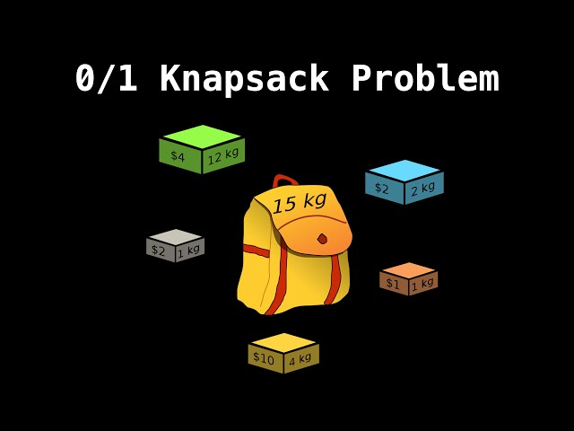
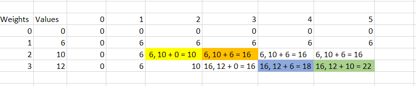

# Understanding the 0/1 Knapsack Problem

## Introduction
The 0/1 Knapsack problem is a classic problem in dynamic programming. It involves selecting items with certain weights and values to maximize the total value while staying within a given weight constraint. Let's delve into the problem and explore its solutions.

## Naive Solution
The naive approach involves considering all possible combinations of items to be included or excluded from the knapsack. This results in an exponential time complexity, making it inefficient for large inputs.

## Tabular Method
### Approach
The tabular method involves building a table to store the maximum value achievable for different weights and items. By considering each item sequentially and updating the table accordingly, we can compute the maximum value efficiently.

### Implementation
Here's a brief overview of the tabular method implementation:
1. Initialize a 2D array `d` to store maximum values.
2. Iterate through each item and capacity combination.
3. Update `d[i, w]` based on whether the current item is included or excluded.
4. Use the values in the table to compute the maximum value for the knapsack.

### Complexity Analysis
The tabular method improves the time complexity from exponential to O(N * W), where N is the number of items and W is the maximum weight capacity of the knapsack. This is achieved by reusing solutions to overlapping subproblems.

## Dynamic Programming Approach
Dynamic programming solves the 0/1 Knapsack problem by breaking it down into smaller subproblems and solving them recursively. It follows the principles of optimal substructure and overlapping subproblems.

### Top-Down Approach
In the top-down approach, we recursively compute solutions to subproblems and store the results. This allows us to reuse solutions and avoid redundant computations.

### Bottom-Up Approach
The bottom-up approach starts from smaller subproblems and builds up to larger ones. By solving smaller subproblems first, we can efficiently compute solutions for larger subproblems.

## Conclusion
The 0/1 Knapsack problem is an important problem in dynamic programming, providing insights into optimizing resource allocation. By understanding its solutions and approaches, we can tackle similar optimization problems effectively.
